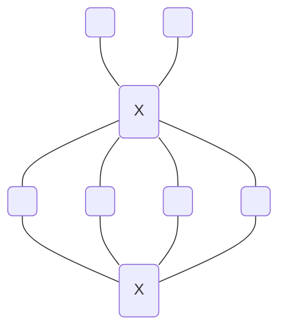

## [1001](http://acm.hdu.edu.cn/contest/problem?cid=1095&pid=1001)
一根棍子，若长度小于等于 $K$ 则可以直接取完，若长度等于 $K+1$
则不能操作，若大于则可以长度减少 $K$ 后分成长度非0的两段，博弈，不能操作者输。

### solution
SG函数打表找规律。


## [1007](http://acm.hdu.edu.cn/contest/problem?cid=1095&pid=1007)
给一张图，求哪些点子集能构成图形

### solution
以图中两个 $X$ 作为标识点，用 ``bitset``
存其连到的边，取与集，即可用组合数选4个。

## [1010](http://acm.hdu.edu.cn/contest/problem?cid=1095&pid=1010)
给一序列，能从中选一些数，要求连续的 $m$ 个数里至少有 $2$
个数被选，求最小选择和。
### solution
$F[i][len]$ 表示当前选的 $i$ 上一个位置距离 $i$ 为 $len$ 的最小代价。

$F[i][len]=a_i+\min_{len'}F[i-len][len']$

做前缀 $\min$ 后省去一维循环 $F[i][len]=\min\{a_i+F[i-len][m-len],F[i][len-1]\}$

为了省空间，要求 $i$ 维度要滚动，滚动最大长度为 $m$ 。

```cpp
#include<algorithm>
#include<cstdio>
#include<cstring>
#include<cmath>
using namespace std;

inline void MAX(long long &x,long long y) {
  (x<y)&&(x=y);
}
inline void MIN(long long &x,long long y) {
  (x>y)&&(x=y);
}
const int MN=2e4+7,MM=2e3+7;
const long long INF=1e17;

int T,n,m;
long long F[MM][MM];

inline long long *G(int i) {
  return F[i%m];
}
void DP(int i,int x) {
  G(i)[0]=INF;
  for ( int j=1;j<=i&&j<m;++j)
    G(i)[j]=min(G(i-j)[m-j]+x,G(i)[j-1]);
  for ( int j=i+1;j<m;++j )
    G(i)[j]=G(i)[j-1];
}

int main() {
  scanf("%d",&T);
  for (;T;--T) {
    scanf("%d%d",&n,&m);
    memset(F[0],0,sizeof(F[0]));
    for (int i=1,x;i<=n;++i) {
      scanf("%d",&x);
      DP(i,x);
    }
    DP(n+1,0);
    printf("%lld\n",G(n+1)[m-1]);
  }
}
```

## [1011](http://acm.hdu.edu.cn/contest/problem?cid=1095&pid=1011)
求一个 $k$ ，对于一个排列 $p_{1\cdots n}$ ，会找到第 $k$ 个后面（不包括）第一个比 $1\cdots k$ 位置上所有数都大的数。对于所有 $n!$ 个可能的排列，要求找到的数是 $n$ 的概率最大。

### solution
假设 $n$ 所在位置为 $l$ ，则前 $k$ 位中一定要包含 $1\cdots l-1$ 的最值，概率为
$\frac{k}{l-1}$ 。故概率最大的位置位于
$\sum\limits_i^k\frac{1}{i}\ge\sum\limits_i^{n-1}\frac{1}{i}-1$ 。

```cpp
#include<bits/stdc++.h>
using namespace std;
double const e=2.718281828459;
double s[10010];
void solve()
{
	int n;
	scanf("%d",&n);
	if(n<=2)
	{
		puts("0");
		return ;
	}
	double p=s[n-1]-1;
	int k=lower_bound(s+1,s+n+1,p)-s;
	printf("%d\n",k);
	return ;
}
int main()
{
	for(int i=1;i<10000;i++) s[i]=s[i-1]+1.0/i;
	int T;
	cin>>T;
	while(T--)solve();
 }
```

## [1012](http://acm.hdu.edu.cn/contest/problem?cid=1095&pid=1012)
每人有一个硬币容量上限 $a_i$ ，每人初始有 $1$ 枚硬币。

给一个序列，元素为 $(A,B)$ ，表示一方能够给另一方一枚硬币（或者不操作）。

给一个人的子集，求经过序列后，子集中的人手中的硬币总数和最大。
### solution
网络流。

建图为对于序列每对 $(A,B)$ ，新建两个点相互连边，边流量为双向 $1$ ，并且点继承于旧点，即旧点向新点连边，边流量为人的硬币容量。

但是我的 ISAP 网络流挂了。用 HLPP 能过。
